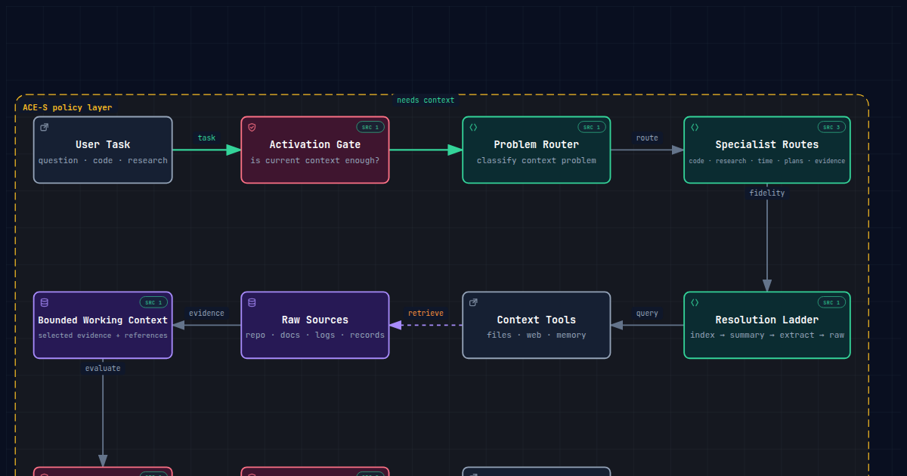

<div align="center">

# ACE-S

### Adaptive Context Engineering Skill

**Give AI agents the right context — and the right context policy — only when they need it.**

[](skills/adaptive-context-engineering/SKILL.md)

[](https://github.com/gyeongbin-38/ACE-S/actions/workflows/validate-skill.yml)
[](benchmarks/POPULAR_REPO_REPLAY.md)
[](docs/archify/ace-s.architecture.html)
[](LICENSE)

</div>

ACE-S is a portable **context-policy controller for AI agents**. It decides whether more context is needed, which kind of context should be inspected next, how much fidelity is necessary, what must survive later steps, and when the agent has enough evidence to stop.

The v0.4 development direction adds one important idea:

> **Policy is context too. Do not preload the whole context-engineering architecture just to decide which part is needed.**

ACE-S therefore uses progressive disclosure on its own instructions: a tiny kernel performs coarse recognition, then only the selected manifest and specialist policy are loaded. Additional concerns such as freshness, provenance, tool discovery, or retention are loaded lazily when they become material.

It is **not** a vector database, memory server, retrieval engine, or replacement for an agent framework. It sits above those systems as a portable decision policy.

---

## Core idea

```text
Task
 ↓
Tiny Kernel
DIRECT / ACTIVE / UNCERTAIN
 ↓
Coarse candidate
one primary + optional backup
 ↓
Manifest index
 ↓
ONE selected manifest
 ↓
ONE specialist policy
 ↓
minimum useful context
 ↓
Sufficiency
 ├─ STOP
 ├─ continue current policy
 ├─ lazy-load ONE newly material policy
 └─ bounded recovery to ONE backup/new candidate
```

This deliberately avoids a giant up-front classifier that tries to decide `CODE + RESEARCH + TEMPORAL + EVIDENCE + PLAN + TOOLS + ...` before the task has produced enough evidence.

An early routing guess is allowed to be wrong. The goal is not perfect first-shot classification; the goal is **cheap recognition, useful progress, and bounded recovery without fan-out**.

---

## Try it

Install with the open `skills` CLI:

```bash
npx skills add gyeongbin-38/ACE-S \
  --skill adaptive-context-engineering
```

Then use your agent normally.

```text
Simple rewrite
→ DIRECT
→ no policy expansion
→ no retrieval

Repository bug
→ CODE manifest
→ coding specialist
→ exact symbol/path
→ local callers/tests only if needed

Repository + latest research
→ CODE first
→ repository evidence
→ external comparison becomes material
→ RESEARCH policy is loaded
→ freshness matters
→ TEMPORAL policy is loaded

Wrong first guess
→ candidate manifest does not fit / makes no progress
→ stop that branch
→ try one backup candidate
→ never load every policy “just in case”
```

See [`docs/QUICKSTART.md`](docs/QUICKSTART.md) and [`examples/`](examples/README.md).

---

## Architecture at a glance

<p align="center">
  <a href="docs/archify/ace-s.architecture.html">
    
  </a>
</p>

The Archify artifact above is the current public architecture showcase. The v0.4 development branch is testing the progressive-policy kernel described in this README; the visual artifact will be regenerated only after that structure clears its evidence gate.

**Artifacts:** [interactive HTML](docs/archify/ace-s.architecture.html) · [typed JSON source](docs/archify/ace-s.architecture.json) · [validation receipt](docs/archify/ace-s.architecture.receipt.json)

---

# Why use it?

Long-context agents fail in both directions, and policy instructions can create the same problem as task context.

| Failure | What happens | ACE-S response |
|---|---|---|
| **Too little context** | dependency, source, or controlling state is missing | expand one narrow step |
| **Too much task context** | distraction, latency, cost, conflicting state | stop on sufficiency; retrieve only useful scope |
| **Too much policy context** | the agent receives every route/rule even when one is relevant | load one manifest + one specialist, lazily expand |
| **Wrong first route** | early classification error cascades through the workflow | bounded backup/switch instead of fatal routing |
| **Wrong resolution** | summary hides exact contract/number | use lowest sufficient fidelity; reopen raw when required |
| **Stale state** | old and new facts are merged | lazily activate temporal/state handling when freshness matters |
| **Long workflow drift** | useful constraints/evidence disappear | activate retention only when later steps need it |
| **Provenance break** | compacted context cannot be audited | preserve source/version/locator back to raw truth |

**No retrieval is a valid action. No policy expansion is also a valid action.**

---

# Benchmarks

ACE-S separates architecture-mechanics evidence from routing/model-quality claims.

## 1. Popular Repo Replay — 21 real bug fixes

We replayed **21 real upstream bug-fix tasks across 7 popular open-source repositories** using published ground-truth files:

`Requests` · `Django` · `Zod` · `Actix Web` · `Gson` · `Gin` · `Kubernetes`

| Metric | Single-pass | **ACE-S** |
|---|---:|---:|
| Exact target localized | 13 / 21 | **20 / 21** |
| Canonical target localized | 14 / 21 | **21 / 21** |
| Cross-repo coverage | 5 / 7 | **7 / 7** |
| Mean retrieval rounds | 1.00 | **1.38** |
| Maximum retrieval rounds | 1 | **3** |
| RepoReplay Score | **72.9 / 100** | **90.2 / 100** |

```text
RepoReplay Score =
  0.60 × exact localization rate
+ 0.25 × retrieval-round efficiency (100 / mean rounds)
+ 0.15 × cross-repo coverage
```

Full methodology and caveats: [`benchmarks/POPULAR_REPO_REPLAY.md`](benchmarks/POPULAR_REPO_REPLAY.md).

> RepoReplay is a retrieval-policy replay. It is not a 90.2% answer-accuracy claim and does not prove a fixed token saving for every agent.

## 2. Selective Policy Load Bench — controller mechanics

The v0.4 development branch tests whether ACE-S can avoid reading its entire policy architecture.

28 oracle-labeled controller fixtures compare four loading strategies:

| Condition | Score | Mechanical success | Wrong-first recovery | Active false-stop | Mean policy bytes | Irrelevant policy bytes |
|---|---:|---:|---:|---:|---:|---:|
| **A — Full Load** | 82.5 | **100.0%** | **100.0%** | **0.0%** | 29,899.6 | 53.8% |
| **B — Hard Single** | 34.2 | 28.6% | 0.0% | 83.3% | **9,687.5** | 6.6% |
| **C — Progressive / No Recovery** | 67.3 | 71.4% | 0.0% | 33.3% | 12,394.1 | 5.2% |
| **D — Progressive + Recovery** | **98.6** | **100.0%** | **100.0%** | **0.0%** | **14,457.1** | **4.4%** |

Under this **controller-mechanics** setup, D matches A's oracle-defined mechanical coverage while loading about **51.6% fewer policy bytes** and **61.2% fewer files on average**.

The important result is architectural:

```text
Full load     → reliable but wasteful
Hard route    → cheap but brittle
Progressive   → selective but first-route errors remain fatal
Progressive + bounded recovery
              → selective and mechanically recoverable
```

Full results: [`benchmarks/POLICY_LOAD_BENCH_RESULTS_V0.1.md`](benchmarks/POLICY_LOAD_BENCH_RESULTS_V0.1.md).

> **Important:** the requirements in this benchmark are oracle-authored. The 98.6 score does **not** mean an LLM has 98.6% routing or answer accuracy. Natural-language candidate selection and end-to-end quality remain separate evidence gates.

## 3. RouterBench — exploratory only

The earlier authored RouterBench experiments are retained for failure analysis, but the high signal-aware scores are **not stable performance claims**. The policy and stress prompts were developed in the same experiment cycle, so leakage/overfitting is plausible.

See [`benchmarks/ROUTERBENCH_RESULTS_V0.1.md`](benchmarks/ROUTERBENCH_RESULTS_V0.1.md).

Stable routing claims require independently authored/blinded prompts and repeated raw model predictions.

---

# Where ACE-S fits

Different context projects solve different layers. They are often complementary.

| Project | Primary strength | Context policy | Code structure | Tool discovery | Persistent memory | Plan-aware | Zero-infra skill |
|---|---|:---:|:---:|:---:|:---:|:---:|:---:|
| **ACE-S** | selective context-policy control | ● | ◐ | ◐ | — | ● | ● |
| **context-router** | structural code context packs | ◐ | ● | — | — | ◐ | — |
| **Ratel** | dynamic tool/skill discovery | ◐ | — | ● | ◐ | — | — |
| **Acontext** | skill-native persistent memory | ◐ | — | ◐ | ● | — | — |
| **memahead** | plan-aware context compression | ◐ | — | ● | — | ● | — |
| **xMemory** | hierarchical long-term memory retrieval | ● | — | — | ● | — | — |

`●` native focus · `◐` partial/policy-level support · `—` not the project's primary job

Example combinations:

```text
ACE-S + context-router  → selective policy + strong code graph backend
ACE-S + Ratel           → selective policy + large tool discovery
ACE-S + Acontext        → selective policy + persistent memory
ACE-S + memahead        → selective policy + plan-aware compression
```

---

# The 7 rules

1. **No Retrieval Is an Action** — if current context is sufficient, answer directly.
2. **Policy Is Context Too** — do not preload every architecture rule.
3. **One Candidate First** — choose one likely policy and at most one backup.
4. **Resolution Before Volume** — use the lowest fidelity that safely solves the current subproblem.
5. **Recover, Do Not Fan Out** — a wrong first candidate should trigger one bounded switch, not load-all.
6. **Summary Is a View, Not Truth** — preserve a route back to exact evidence when it matters.
7. **Expand on Insufficiency** — not because more context or more policies are available.

Priority:

```text
correctness & completeness
        > provenance & recoverability
        > context efficiency
        > latency
```

---

# Skill layout

```text
skills/adaptive-context-engineering/
├── SKILL.md                    # tiny always-loaded kernel
├── manifests/
│   ├── INDEX.md                # compact policy directory
│   ├── code.md
│   ├── document.md
│   ├── research.md
│   ├── state.md
│   ├── temporal.md             # lazy modifier
│   ├── evidence.md             # lazy modifier
│   ├── tools.md                # lazy modifier
│   └── retention.md            # lazy modifier
├── references/
│   ├── coding.md
│   ├── long-document.md
│   ├── research.md
│   ├── temporal.md
│   ├── evidence-and-provenance.md
│   ├── plan-aware.md
│   ├── tool-discovery.md
│   └── resolution-ladder.md
└── evals/
    └── evals.json
```

The intended load path is **kernel → index → selected manifest → selected specialist**, not `SKILL.md → every reference`.

The skill itself requires no vector database, embedding model, API key, or background service.

---

# Experimental contracts

The v0.4 branch exposes a small trace vocabulary in [`docs/CONTEXT_CONTRACTS.md`](docs/CONTEXT_CONTRACTS.md):

- `ContextIntent` — coarse primary + optional backup candidate;
- `PolicyLoadState` — which manifests/specialists were actually loaded and recovery count;
- policy-scoped `ContextSignals` — local categorical observations, not one giant global vector;
- `ContextDecision` — one next action, including bounded `SWITCH_POLICY`;
- `EvidencePacket` — recoverable source truth;
- `SufficiencyReport` — explicit stop/expand state;
- optional retention/handoff state for long-running work.

The contracts are backend-neutral and remain experimental until validated against real agent traces.

---

# Benchmark policy

ACE-S uses separate evidence levels:

1. **Controller-mechanics / synthetic benchmark** — screens architecture behavior and policy-loading cost.
2. **Natural-language routing benchmark** — evaluates whether models select/recover policies on independently authored prompts.
3. **Live public-repo replay** — tests retrieval behavior against real repositories and ground truth.
4. **End-to-end agent A/B** — same model/tasks with ACE-S OFF vs ON; required before general answer-quality or token-efficiency claims.

We intentionally publish misses, leakage risks, and no-uplift cases instead of optimizing for a headline score.

---

# Status

**v0.3.0-alpha** — public research alpha.  
**v0.4 development branch** — progressive policy loading + bounded recovery under evaluation.

Current next evidence gates:

1. freeze the progressive controller mechanics;
2. create an independently authored/blinded natural-language routing/recovery set;
3. run repeated frontier-model routing traces;
4. run same-model end-to-end agent A/B;
5. require quality preservation before counting context/policy savings.

See [`ROADMAP.md`](ROADMAP.md), [`benchmarks/AGENT_AB_PROTOCOL.md`](benchmarks/AGENT_AB_PROTOCOL.md), and [`CONTRIBUTING.md`](CONTRIBUTING.md).

## License

MIT
